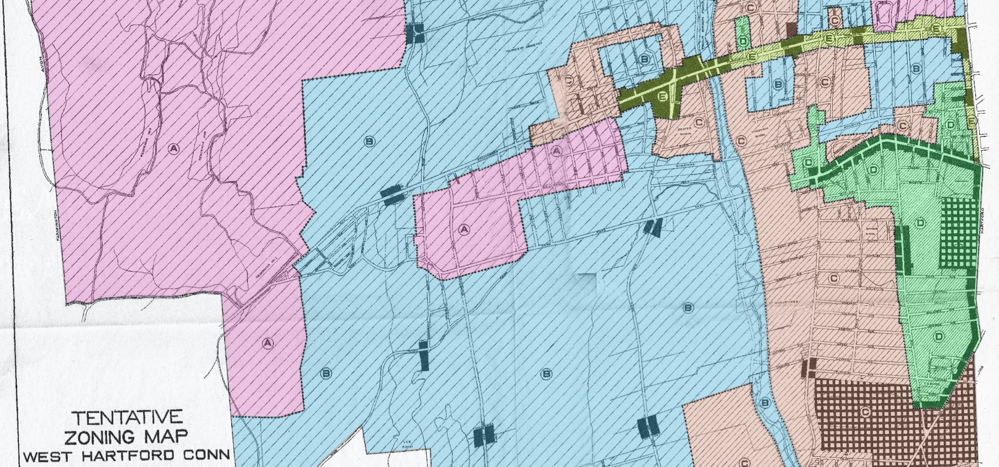

# otl-zoning-west-hartford
Side-by-side Zoning Maps in West Hartford CT, 1924-present
Leaflet synchronized dual maps, with geosearch and permalink features.
Georeferenced 1924 zoning map and shapefiles for use districts (residential, business, industrial) and area districts (A-E).

## Live map
https://ontheline.github.io/otl-zoning-west-hartford/index-caption.html

## Credits
1924 digitization and interactive Leaflet map developed by Ilya Ilyankou/Picturedigits and Jack Dougherty for On The Line, http://OnTheLine.trincoll.edu, Trinity College, Hartford CT

Replaces 2012 UConn Library MAGIC Google Map http://magic.lib.uconn.edu/otl/dualcontrol_zoning_westhartford.html

## Sources
Whitten, Robert Harvey. [West Hartford Zoning: Report to the Zoning Commission on the Zoning of West Hartford](http://magic.lib.uconn.edu/magic_2/raster/37840/hdimg_37840_155_1924_unkn_CSL_1_p.pdf). West Hartford, Conn: Zoning Commission, 1924 (courtesy of the Connecticut State Library).

Zoning maps, 1930, 1951, 1960, 1970, 1988, Town of West Hartford, Connecticut (with assistance from Jeffrey Roller), on MAGIC Web Mapping Service (WMS), http://magic.lib.uconn.edu/help/help_WMS.htm

West Harford property parcels, 2020, CT DEEP, https://ct-deep-gis-open-data-website-ctdeep.hub.arcgis.com/datasets/connecticut-parcels-/data?geometry=-73.130%2C41.653%2C-72.290%2C41.832&orderBy=TOWN&where=TOWN%20%3D%20%27West%20Hartford%27

## Georeferencing
The original 1924 JPG map was georeferenced using [QGIS Georeferencer](https://docs.qgis.org/3.16/en/docs/user_manual/working_with_raster/georeferencer.html) tool. About 40 ground control points were chosen (available in `georeferencing/gcp.points`). The GeoTIFF is too heavy for GitHub, but is easy to recreate.

1. Open the JPG map in Georeferencer.
1. Load GCP points file.
1. In Transformation Settings, set type to *Thin Plate Spline*, resampling method to *Nearest neighbor*, and target SRS to *EPSG:3857* (Web Mercator).
1. Hit the *Play* button to generate a GeoTIFF.

Note that western part of West Hartford is rural, with few roads and intersections that can be reliably used for georeferencing.

## Shapefiles
Shapefiles for use and area districts were manually created in QGIS. They are available from `shapefiles/` folder, as well as GeoJSONS (see `geojson/` folder).

## Notes
* Each polygon contains *acres* property with its area expressed in acres (rounded to 1 decimal).
* PDFs with semi-transparent maps were created to assess the accuracy of the output.

## Dependencies
- Leaflet https://leafletjs.com
- jQuery https://jquery.com/
- Esri Leaflet for Esri imagery and labels https://github.com/Esri/esri-leaflet/
- L.Map.Sync v0.2.4 to synchronize map movements https://github.com/turban/Leaflet.Sync

## Known issues
- Console warning: Mixed content (http served over https). Asked UConn MAGIC about future https support for WMS server or alternate map source.
